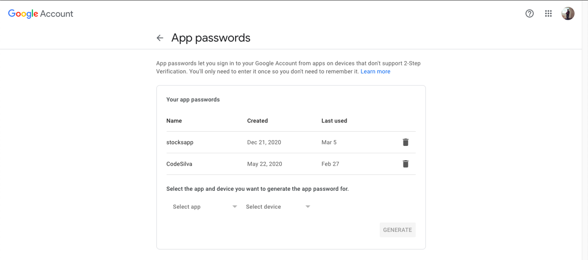
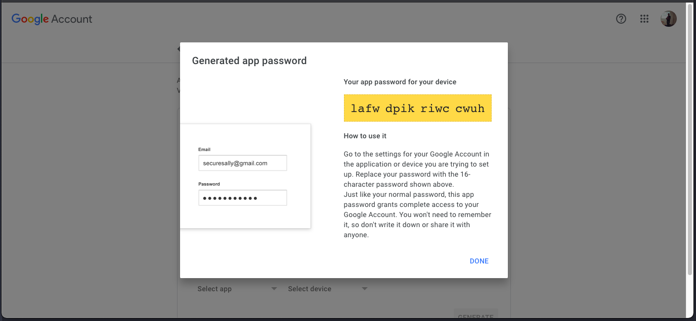

# no-secreto

Fast, Unopinionated, Minimalistic Open-Source Passwordless Authentication Library for NodeJs.

For detailed organized documentation click [here](https://docs-no-secreto.vercel.app/)

# What is no-secreto?

no-secreto is a library to help you add passwordless authentication in your nodejs applicaiton.

# Getting Started

Let's discover **no-secreto**.

This is a **beta** version of no-secreto. It is not ready for production use yet.

## Installation

This is a Node.js module available through the npm registry.

If this is a brand new project, make sure to create a package.json first with the

```bash
yarn init command.
```

```bash
yarn install no-secreto
```

### What you'll need

- [Node.js](https://nodejs.org/en/download/) version 14 or above:
  - When installing Node.js, you are recommended to check all checkboxes related to dependencies.

## Types

Although there are many types of passwordless authentication, no-secreto supports only two type as of now:

- Email-based passwordless authentication.

- SMS-based passwordless authentication

# Email Authentication

Email Based Passwordless Authentication

## Set Email Details

In order to send OTP to the user, we need to set the email details.

## By Using Default Settings

Under the hode, no-secreto uses **nodemailer** to send OTP to the user. The default settings are:

    {
      "host": "smtp.gmail.com",
      "port": 465,
      "secure": false,
    }

Follow the steps below to set the email details using the default settings:

### Step-1

As of 02/05/2022, Gmail has changed the password policy. You will need to generate a new password for your application, in order to use Gmail as your email service. You can do this by following the steps below:

- Go to https://myaccount.google.com/ and in the left sidebar click in Security, find "Signing in to Google", click in 2-Step Verification and enable it.

- After enabling 2-Step Verification you'll see another option that is App Passwords. Click on this option and you'll see a page like the one shown below in the image.



To create a new app password click "Select app" combobox, select Other, define a name and click in Generate. A dialog box will appear with the password. See below.



copy the password and paste it in the `password` field at Step-2.

### Step-2

Use the following code to set the email details:

```javascript
import { setEmailDetails } from 'no-secreto';

const setDetails = setEmailDetails('your@emailid.com', 'yourpassword');
```

This will set email details and return true

## By Using Custom Settings

You can also use another smtp provider to send OTP to the user.

```javascript
import { updateDetails } from "no-secreto";

*/
@param {string} smtp host
@param {number} port
@param {boolean} ssl
*/
updateDetails("smtp.outlook.com", 587, false);
```

This will update the default email details and return true

You need to set the email details before sending OTP to the user.

## Send OTP

To send the OTP to the user, use the following method:

```javascript
import { sendEmail } from 'no-secreto';

const sendEmailToUser = sendEmail('users@emailId.com');
```

The function returns true and logs nodemailer response if the email is sent successfully.

## Turn off console logging

```js
import { turnOffEmailConsole } from 'no-secreto';

turnOffEmailConsole();
```

## Verify OTP

```javascript
import { verifyOTP } from 'no-secreto';

const verify = verifyOTP('users@emailId.com', 'OtpEnteredByUser');
```

This function returns **user** if the OTP is valid and false if it is not.

# SMS Authentication

SMS-Based Passwordless Authentication

## Set SMS Details

For sending SMS otp, currently **no-secreto** supports only **Twilio**. You need a twilio account to use this feature. You can sign up for a twilio account [here](https://www.twilio.com/).

In this tutorial, we will learn how to set up SMS based passwordless authentication.
You need to provide your Twilio account details to use this feature. It is done in the following way:

```js
import { setSMSDetails } from 'no-secreto';

const details = {
  accountSid: 'ACXXXXXXXXXXXXXXXXXXXXXXXXXXXXXXXX',
  authToken: 'your_auth_token',
  fromNumber: '+12345678901',
};
```

- AccountSid: Your Twilio account SID.
- AuthToken: Your Twilio auth token.
- FromNumber: Your Twilio phone number.

## Send OTP

Once you have set up SMS details, you can use it to send SMS otp.

```js
import { sendSMS } from 'no-secreto';

const sms = sendSMS('+XXXXXXXXXX');
```

This will send an SMS otp to the given phone number and return true if the SMS was sent successfully.

## Verify OTP

You can verify the OTP sent to your mobile number by using the following way:

```js
import { verifySMS } from 'no-secreto';

const verify = await verifySMS('+XXXXXXXXXX', 'OTP');
```

This will return true if the OTP is valid.
